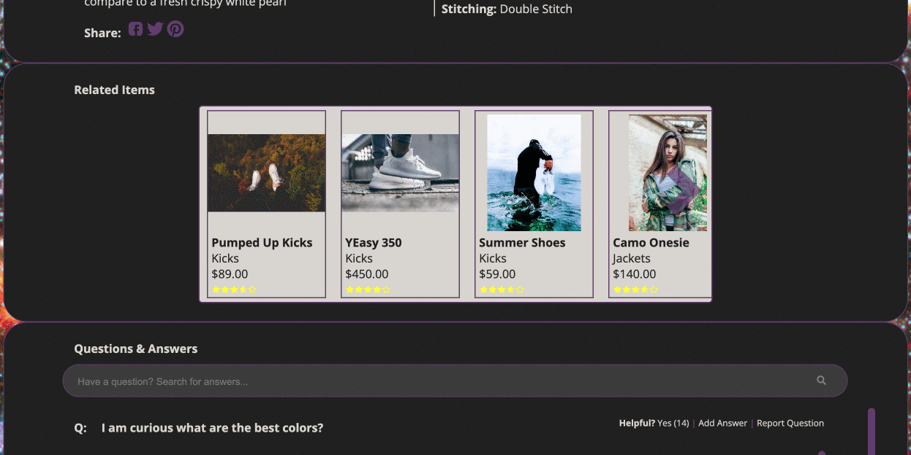
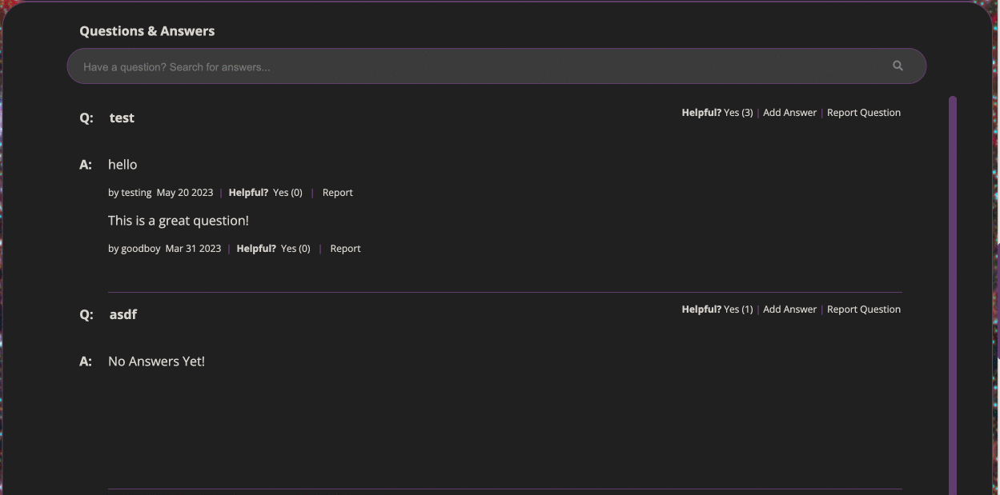
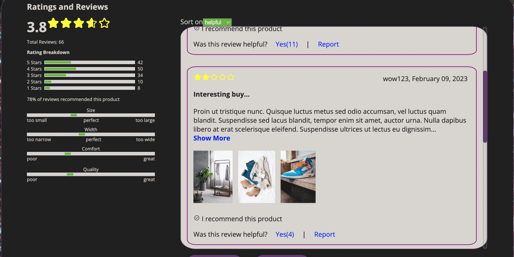

## JSX Front End Page

**Overview**
The JSX front end page is a front end development project that demonstrates various features implemented using JavaScript technologies like React.js, Axios, babel, webpack, and Express.js. The site page allows you to explore a given product with an overview, related products, question and answers associated with it, and ratings and reviews. Each of these modules have various levels of interactivity such as carousels, search bars, list sorting, and list filter settings. The page interacts with the Atelier API to present product information.

### **Table of Contents**
- [Setup](#setup)
  - [Obtaining an API Key](#obtaining-an-API-Key)
- [Description](#description)
  - [Overview](#overview)
  - [Related Products](#related-products)
  - [Questions and Answers](#questions-and-answers)
  - [Ratings and Reviews](#ratings-and-reviews)

### **Setup**
- In order to setup the repo, first use your terminal navigate to the directory you will clone this repo in.
- Run the following command in your terminal
-- `git clone "URL-of-this-repo"`
-- You can get the URL of this repo by clicking on the green "< > Code" button above and copying the HTTPS url.
- Navigate into the cloned directory from within the terminal
- Make sure you have npm and/or Node.js installed before moving forward
- Run this command
-- `npm install`
- Create a .env file and add the following:

> API_TOKEN = "Your-Own-Github-API-Token"
>
> SERVER_PORT = 3000
>
> API_URL = https://app-hrsei-api.herokuapp.com/api/fec2/hr-rfe

- In order to compile the code to be presented and to start the server, run the following commands
-- `npm run react-dev`
-- `npm run server-dev`
- Open the browser and navigate to the URL:
-- localhost:3000
- You should now be able to view and interact with the website

*Instructions on obtaining an API key are below
### Obtaining an API Key

Our API server authenticates users with GitHub Personal Access Tokens. To obtain a token:

1.  Go to: https://github.com/settings/tokens
2.  Click "Generate new token"
3.  Given the Token a Description
4.  Under Select Scopes, select the following: (You may select more for more features this API will offer in the future)
    -   read:org
    -   user
    -   read:user
    -   user:email
    -   user:follow
5.  Generate Token
    -   Note that this token is  only viewable once, at generation time.  Make sure to copy it to a  **secure**  place and  _**never check it into your git history**_.

### **Description**
The JSX project can be divided into four modules. There is an Overview, Related Products, Questions and Answers, and Ratings and Reviews. You can use each of these sections to find out more information regarding the product selected. The following sections describe a list of features associated with each module.

### Overview
At the very top of the page is the overview page. It presents a gallery of the product. To the right of the gallery is an overall rating for the product. Clicking on the rating will bring you to the Ratings and Reviews module. To the left of the product is a list of thumbnails in a vertical carousel. Thumbnails can be selected to change the main image. They can also be scrolled through to view more. There is an expanded view option that allows you to view a full screen view of the image. The expanded view brings up a modal window that shows a high resolution image of the product. Inside the modal is a horizontal carousel. Click on this full screen view lets you zoom in on the image and move about it using only the mouse.

To the right of the gallery is a description of the product along with style selectors. You can select a style, a size, and a quantity before add the product to the cart. The overview is keeps track of product inventories and prices based off the style and reflects the information accordingly. Below is a description of the product itself. There are buttons that link to other social media sites that allow you to share information about the product.

### Related Products
Related products presents as a horizontal carousel showing cards of various related products. The products have preview thumbnails of associated products. They display the name and rating of the product as stars. Hovering over the stars will give you a number display. You can click on related product cards to change the product that you are viewing.

### Questions and Answers
The Questions and Answers consists of a search bar, a list of questions, and a list of answers. The search bar allows a client to search through the questions in real time. It will not begin its search query until three characters are inside of the search bar. The section will be updated in real time to show results of search queries. As for the list of questions itself, it displays two questions at a time. A user can display two more questions at a time by clicking on the "More Answered Questions" button. Once the number of questions exceeds the view of the screen, a scroll bar appears and allows the user to scroll through the list of questions. When all the questions are listed, the button disappears.

The individual questions feature an answer list, a helpful button, an add answer button, and a report question feature. The answer list features a list of answers to the question. This answer list displays a list of at least 2 answers to the question. If there are more answers, you can select a "See More Answers" button that will provide a scrollable list of the remaining answers. Both questions and answers feature a helpful button or a report button. Both buttons can only be selected once by users.

Inside the Questions and Answers section are two buttons that bring up modal forms. On individual questions is an "Add Answer" link. This brings up a "Submit Your Answer" form. This form takes the text input of an answer, a nickname, and an email. There is also a photo upload feature. It allows you to select up to 5 photos to be uploaded. The upload feature allows you to preview the photos before submission (note that the API does not actually accept uploaded photo files and will not display them after the form is submitted. There is no image hosting). The "Add A Question +" button will bring up the "Ask A Question" modal. This modal accepts the same types of input as the answer modal in the context of asking questions except for the photo upload.

### Ratings and Reviews
For the Ratings and Reviews section, you are provided with a breakdown of the ratings and reviews and a list of the reviews. The rating and product breakdown provides statistical information such as total reviews and the percentage of reviews that recommend the product. They also provide percentages on how many reviews out of the total gave a certain rating and what ratings were given to certain product characteristics. The characteristics reviewed depends on the product in question. Characteristics could include size, comfort, width, length, fit, and quality. The ratings and breakdowns show these percentages in the form of gray bars partially filled by green bars. The product breakdown uses a single marker. The rating breakdown bars can be selected in order to filter the review list on the right based on the ratings selected. For example, selecting the 1 star and 5 star bars will filter the list to only show 1 and 5 star reviews. You can remove filters by clicking on the bar a second time or selecting the "Remove all filters" link. Doing so will revert the list back to its original state.

The review list on the right as a number of different functionalities. You can sort the reviews based off of three sort options: relevant, helpful, and newest. Doing so will update the list in real time. The list presents reviews as individual review tiles. Reviews are only displayed two at a time. Selecting the "More Reviews" button will provide two more reviews. Once the list becomes the size of the view page, it will add a scroll bar. When the maximum number of reviews are displayed, the "More Reviews" button disappears.

Individual review tiles display information and reviews and take some interaction from the user. They display dates, the review summary, the review body, responses from the seller, star ratings depending on their rating, images they uploaded and if they recommend the product. A user can mark a review as helpful or report it once. Selecting an image will product an image modal that shows the image at full screen.

Finally, a user can add their own review of the product at the bottom. Clicking on the "Add A Review" opens up a modal form where you can add your own review. You have to make selections that are starred. In the form, you can submit an overall rating by selecting a star option, recommend the product, rate characteristics, add a review summary, add a review body (minimum of 50 characters), upload and preview photos (again, the API does not accept actual photos. A placeholder photo will be put instead), add a nickname, and add an email. The form will not submit until the starred options are completed. If they are not complete, a message will display below the submit button telling you what fields need to be filled before submission. After submitting, selecting a different sort option will update the list. You can sort by newest to see your review.

Project Creators - Xinhuang Liu, Sean Jung, John Novakowski